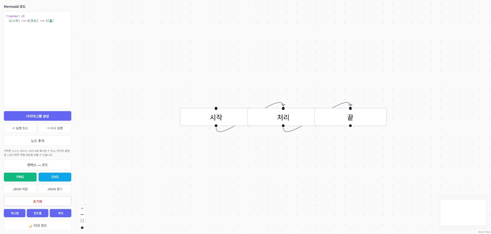
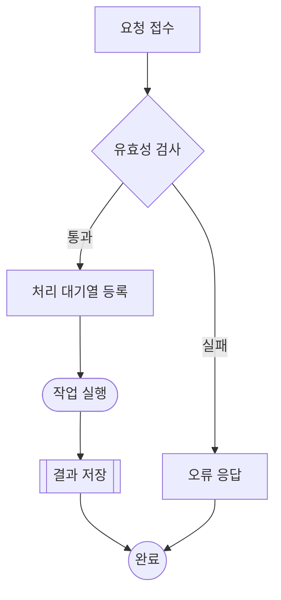
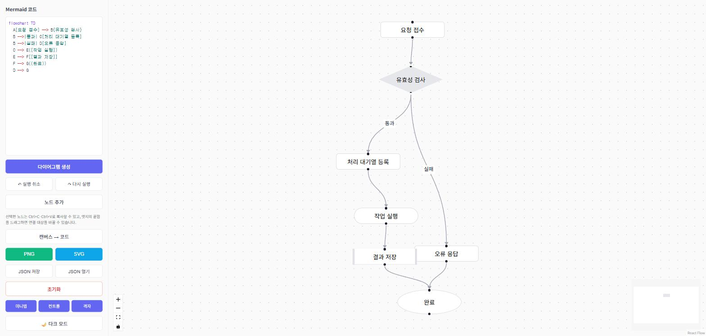
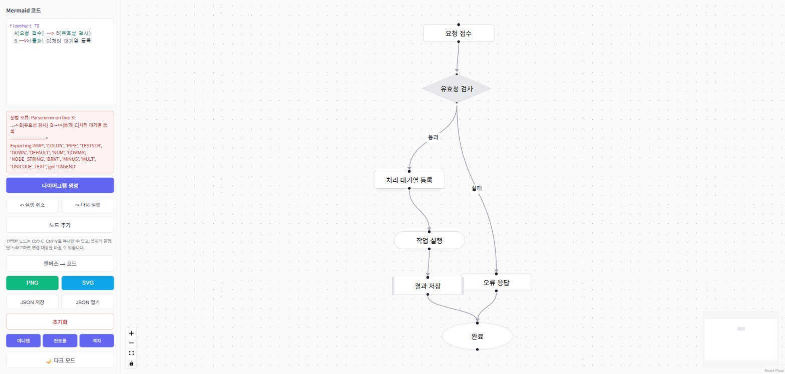
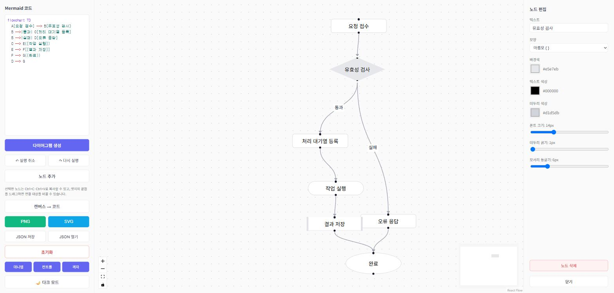
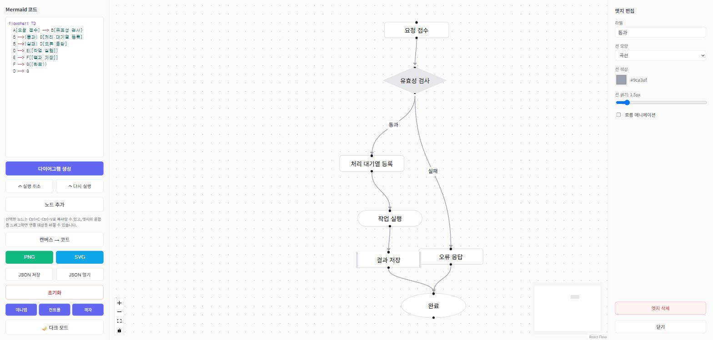
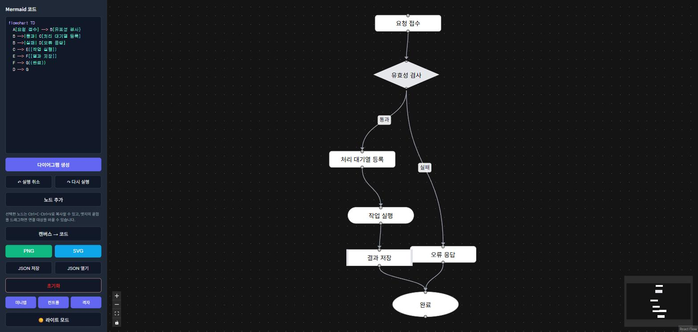
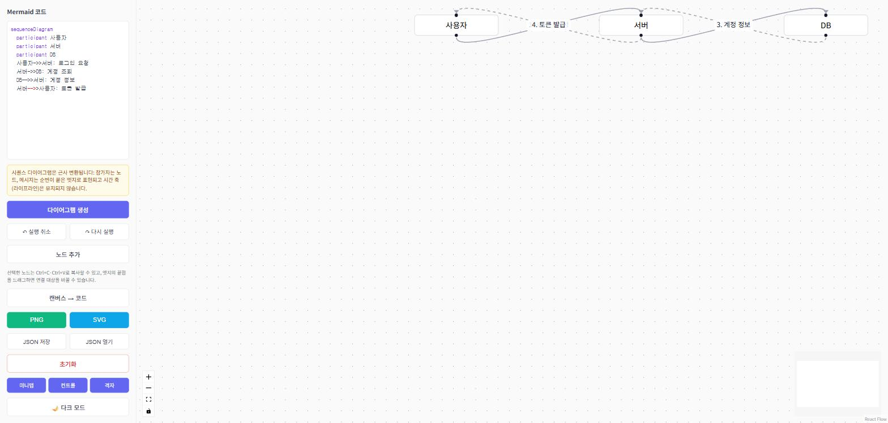
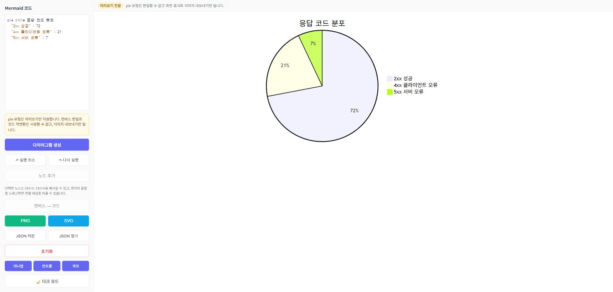

# Mermaid Studio 사용 가이드

이 문서는 Mermaid Studio의 화면 구성과 작업 흐름을 설명합니다. 스크린샷은 개발 서버(`npm run dev`)를 1440×900 크기의 창에서 실행해 촬영했습니다.

## 1. 화면 구성

앱을 처음 열면 화면이 세 영역으로 나뉩니다.

- **왼쪽 사이드바**: Mermaid 코드 편집기와 모든 명령 버튼이 있습니다.
- **가운데 캔버스**: 코드에서 변환된 노드와 엣지를 직접 옮기고 연결하는 영역입니다.
- **오른쪽 패널**: 노드나 엣지를 선택했을 때만 나타나는 속성 편집 패널입니다.

코드 편집기는 문법 강조를 지원합니다. 키워드, 노드 라벨, 화살표, 문자열, 주석을 각각 다른 색으로 표시하므로 구조를 눈으로 구분할 수 있습니다.

## 2. 코드에서 다이어그램 만들기

편집기에 Mermaid 코드를 입력하면 **입력이 멈춘 뒤 600밀리초** 후에 자동으로 캔버스에 반영됩니다. 즉시 반영하고 싶으면 `다이어그램 생성` 버튼을 누르십시오. 코드에서 다이어그램을 새로 만들 때마다 캔버스는 전체가 보이도록 배율을 맞춥니다.

위 코드를 입력하면 다음과 같이 변환됩니다. 사각형, 마름모, 스타디움, 서브루틴, 원 같은 노드 모양과 엣지 라벨이 모두 함께 옮겨집니다.

문법에 오류가 있으면 편집기 아래에 mermaid 파서가 알려 준 오류 위치와 원인이 그대로 표시되고, 캔버스는 마지막으로 성공한 상태를 유지합니다.

## 3. 노드 편집

노드를 클릭하면 오른쪽에 `노드 편집` 패널이 열립니다.

패널에서 다음 항목을 바꿀 수 있습니다.

| 항목 | 설명 |
| --- | --- |
| 텍스트 | 노드에 표시되는 라벨입니다. |
| 모양 | 사각형, 둥근 사각형, 스타디움, 원, 마름모, 육각형, 서브루틴, 평행사변형, 사다리꼴 중에서 고릅니다. 괄호 문법이 함께 표시되므로 Mermaid 코드와 대응 관계를 확인할 수 있습니다. |
| 배경색·텍스트 색상·테두리 색상 | 색상 선택기로 지정합니다. |
| 폰트 크기·테두리 굵기·모서리 둥글기 | 슬라이더로 조절합니다. |

노드를 다루는 그 밖의 방법은 다음과 같습니다.

- `노드 추가` 버튼을 누르거나 캔버스의 빈 곳을 더블클릭하면 그 자리에 새 노드가 생깁니다.
- 노드의 연결점을 다른 노드로 드래그하면 새 엣지가 만들어집니다.
- `Ctrl`(macOS에서는 `Cmd`)을 누른 채 노드를 클릭하면 여러 개를 함께 선택할 수 있고, 이때는 오른쪽에 일괄 편집 패널이 열립니다.
- 선택한 노드는 `Ctrl+C`로 복사하고 `Ctrl+V`로 붙여 넣습니다.
- `Delete` 또는 `Backspace` 키로 선택한 노드와 엣지를 지웁니다.

## 4. 엣지 편집

엣지나 엣지 라벨을 클릭하면 `엣지 편집` 패널이 열립니다.

라벨 텍스트, 선 모양(곡선·계단·직선), 선 색상, 선 굵기를 바꾸고 `흐름 애니메이션`을 켜서 방향을 강조할 수 있습니다. 엣지의 끝점을 드래그하면 연결 대상을 다른 노드로 바꿀 수 있습니다.

## 5. 캔버스에서 코드로 되돌리기

캔버스에서 노드를 추가하거나 모양을 바꾼 뒤 `캔버스 → 코드` 버튼을 누르면 현재 캔버스 내용이 Mermaid 코드로 역변환되어 편집기에 들어갑니다. 이때는 자동 렌더링이 한 번 생략되므로, 손으로 맞춰 놓은 노드 위치와 색상이 mermaid 레이아웃으로 초기화되지 않습니다.

역변환은 캔버스를 만든 원본 유형의 문법으로 내보냅니다. `mindmap`과 `requirementDiagram`은 각각 자기 문법으로 돌아가고, 나머지 유형은 `flowchart` 문법으로 통일합니다. 즉 `classDiagram`이나 `stateDiagram`으로 시작한 다이어그램은 flowchart 형식이 됩니다. 노드 모양은 괄호 문법으로, 점선과 굵은 선은 대응하는 화살표 문법으로 되살아납니다.

`mindmap`은 트리 하나만 표현할 수 있는 문법이므로, 캔버스에서 어느 노드에도 연결하지 않은 노드나 부모가 둘이 되는 엣지는 코드에서 빠지고 안내 메시지로 알려 줍니다.

## 6. 내보내기와 저장

| 버튼 | 결과 |
| --- | --- |
| `PNG` | 캔버스를 PNG 이미지 파일로 내려받습니다. |
| `SVG` | 캔버스를 SVG 벡터 파일로 내려받습니다. |
| `JSON 저장` | 코드와 노드·엣지를 한꺼번에 담은 작업 파일을 내려받습니다. |
| `JSON 열기` | 저장해 둔 작업 파일을 다시 불러옵니다. |
| `초기화` | 코드와 캔버스를 기본 상태로 되돌리고 자동 저장 내용도 지웁니다. |

작업 중인 코드와 캔버스는 브라우저의 localStorage에 자동으로 저장됩니다. 페이지를 새로 고치거나 브라우저를 다시 열어도 마지막 상태가 복원됩니다.

## 7. 보기 설정과 다크 모드

사이드바 아래쪽의 `미니맵`, `컨트롤`, `격자` 버튼으로 캔버스의 보조 UI를 각각 켜고 끌 수 있습니다. 설정은 localStorage에 저장되어 다음 실행에도 유지됩니다.

`🌙 다크 모드` 버튼을 누르면 사이드바와 캔버스가 어두운 배색으로 바뀝니다. 노드와 엣지의 색상은 사용자가 지정한 콘텐츠이므로 테마를 바꿔도 그대로 유지됩니다.

## 8. 다이어그램 유형별 지원 범위

### 완전히 편집할 수 있는 유형

`flowchart`(`graph`), `classDiagram`, `stateDiagram`, `erDiagram`, `mindmap`, `requirementDiagram`은 노드와 엣지로 변환되어 캔버스에서 자유롭게 편집할 수 있습니다.

`mindmap`은 중심 주제를 뿌리로 삼는 트리이므로, 부모에서 자식으로 가는 엣지가 그대로 계층이 됩니다. 노드의 모양을 바꾸면 역변환할 때 `((원))`, `[사각]`, `{{육각}}` 같은 원래 괄호 문법으로 되돌아갑니다.

`requirementDiagram`은 요구사항과 요소의 속성을 노드 라벨의 `키: 값` 여러 줄로 옮깁니다. 사이드 패널의 텍스트 상자에서 `Risk: high`처럼 값을 고치면 역변환한 코드에도 그대로 반영됩니다. mermaid가 허용하지 않는 값(예: `risk`에 `low`·`medium`·`high` 외의 값)을 적으면 해당 줄을 빼고 안내 메시지로 알려 줍니다.

### 근사 변환되는 유형

`sequenceDiagram`은 참가자를 노드로, 메시지를 순번이 붙은 엣지로 바꿉니다. 시간 축(라이프라인)은 노드-엣지 모델로 옮길 수 없으므로 유지되지 않습니다. 변환 직후에는 안내 메시지가 표시됩니다.

참가자는 원본 다이어그램의 순서대로 가로로 배치됩니다. 다만 같은 두 참가자 사이를 오가는 메시지는 캔버스에서 같은 경로에 그려지므로, 라벨이 서로 겹쳐 나중 번호만 보입니다. 메시지의 전체 순서는 코드에서 확인하십시오.

### 미리보기만 되는 유형

`pie`, `gantt`처럼 노드-엣지 모델로 옮길 수 없는 유형은 mermaid가 그린 SVG를 그대로 보여 주는 미리보기 전용 모드로 전환됩니다. 화면 위쪽에 `미리보기 전용` 표시가 붙고, `노드 추가`와 `캔버스 → 코드` 버튼은 비활성화됩니다. 이미지 내보내기는 그대로 사용할 수 있습니다.

## 9. 단축키

| 단축키 | 동작 |
| --- | --- |
| `Ctrl+Z` | 실행 취소 |
| `Ctrl+Shift+Z` 또는 `Ctrl+Y` | 다시 실행 |
| `Ctrl+C` / `Ctrl+V` | 선택한 노드 복사·붙여넣기 |
| `Delete` / `Backspace` | 선택한 노드·엣지 삭제 |
| `Ctrl` + 클릭 | 여러 노드 다중 선택 |
| 캔버스 빈 곳 더블클릭 | 그 자리에 새 노드 추가 |

macOS에서는 `Ctrl` 대신 `Cmd`를 사용합니다.
